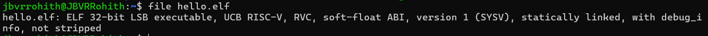

# 📂Compile "Hello, RISC-V"
Converting the program wirtten in C language to machine readable language using GCC.

---

## Step 1: The C Program: hello.c C
Write the program in C language and save it.
```bash
#include <stdio.h>

int main() {
  printf("Hello, RISC-V");
  return 0;
}
```
## Step 2: The Compilation Command ⚙️
Compiling the C program
Open the terminal at your program directory 
```bash
riscv32-unknown-elf-gcc -march=rv32imc -mabi=ilp32 -o hello.elf hello.c
```
<details>
<summary><strong>riscv32-unknown-elf-gcc:</strong> This is the cross-compiler.</summary>
  
- **`riscv32`**: Specifies the target architecture – RISC-V 32-bit.
- **`unknown`**: Indicates that the vendor of the target system is unknown or not specified.
- **`elf`**: Specifies the output file format – Executable and Linkable Format (ELF), a common standard for executables and object code.
- **`gcc`**: Stands for GNU Compiler Collection, the actual compiler.
</details>
 
<details>
<summary><strong>-march=rv32imc:</strong> This flag specifies the target microarchitecture.</summary>
  
  - **`rv32i`**: This is the base 32-bit RISC-V integer instruction set.
  - **`m`**: This indicates support for integer multiplication and division instructions.
  - **`c`**: This indicates support for compressed instructions (which help reduce code size). 
  - So, you're telling the compiler to generate code compatible with a RISC-V processor that has these specific features.
    
</details>

<details>
<summary><strong>-mabi=ilp32:</strong> This flag sets the Application Binary Interface (ABI).</summary>
  
  **`ilp32`**: Stands for "Integer, Long, Pointer are 32-bit". This defines how data types are represented in memory and how function calls are made. It means int, long, and pointers are all 32 bits wide on this target.
  
 </details>
 
 <details>
<summary><strong>-o hello.elf:</strong> This is the output file flag.</summary>

- **`-o`**: Tells the compiler to place the output in the file that follows.  
- **`hello.elf`**: This will be the name of your compiled executable program.

</details>

<details>
<summary><strong>hello.c:</strong> This is your source code file.</summary>

- The C program you wrote in step 1.  
- It serves as the input for the compiler.

</details>

## Step 3: Verifying the Output 🧐

After running the compilation command, you use the `file` utility to check the generated file:
```bash
file hello.elf
```
The `file` command examines a file and tries to determine its type. 

