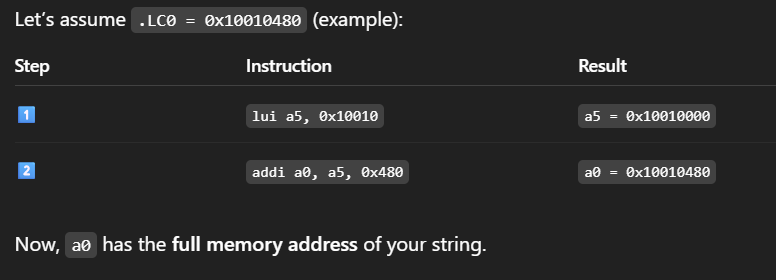
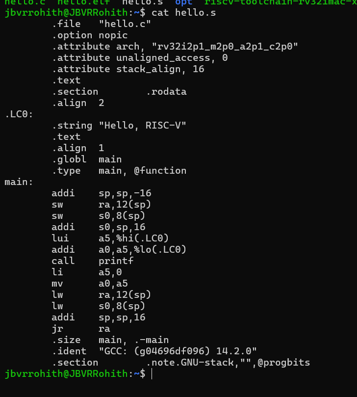

# From C to Assembly

---

## ✅ Step 1: Generate the .s (assembly) file
```bash
riscv32-unknown-elf-gcc -S -O0 hello.c
```
<details>
  
<summary><strong>riscv32-unknown-elf-gcc:</strong> This is the cross-compiler.</summary>
  
- **`-S`**: tells the compiler to stop after generating assembly.
- **`O0`**: disables optimization, so the output is easier to read.
- This produces hello.s, which contains RISC-V assembly code.

</details>

##✅ Step 2: Understand the Function Prologue & Epilogue
🔹 **Prologue**:
```bash
main:
    addi    sp,sp,-16       # Allocate 16 bytes on the stack
    sw      ra,12(sp)       # Save return address
    sw      s0,8(sp)        # Save frame pointer
    addi    s0,sp,16        # Set up new frame pointer (s0 = old sp)
```
🔍 Purpose:
- Reserves stack space.
- Saves return address (ra) and previous frame pointer (s0) for safe return and stack tracing.
- Sets a new base pointer.

🔹 Preparing for **`printf`**
```bash
lui     a5, %hi(.LC0)       # Load upper 20 bits of address into a5
addi    a0, a5, %lo(.LC0)   # Add lower 12 bits to get full address into a0
```
They are compiler pseudo-instructions that split a 32-bit address (like .LC0) into two parts:

- **`%hi(symbol)`** — extracts the upper 20 bits of the symbol's address.
- **`%lo(symbol)`** — extracts the lower 12 bits of the symbol's address.
- **`addi`** can only handle 12-bit signed immediates.
  


🔹 **Epilogue**:
```bash
    lw      ra,12(sp)       # Restore return address
    lw      s0,8(sp)        # Restore old frame pointer
    addi    sp,sp,16        # Deallocate stack frame
    jr      ra              # Return to caller (exit main)
```
🔁 Restores the original stack state and exits the function.

## Output


