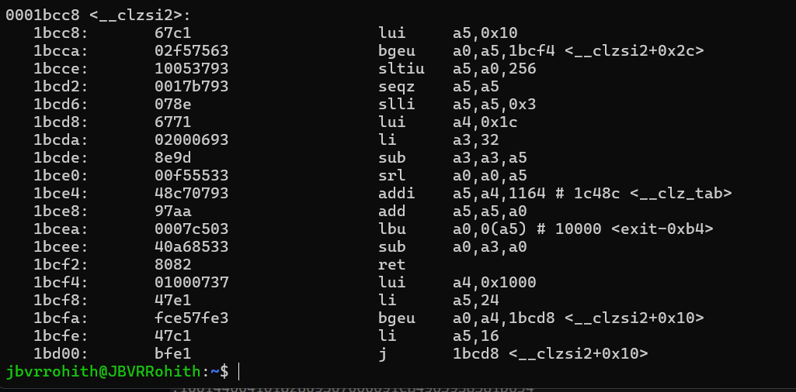
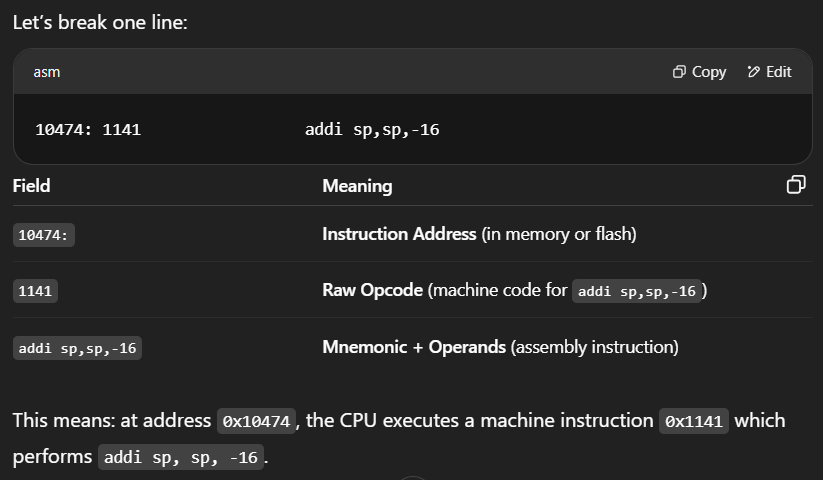
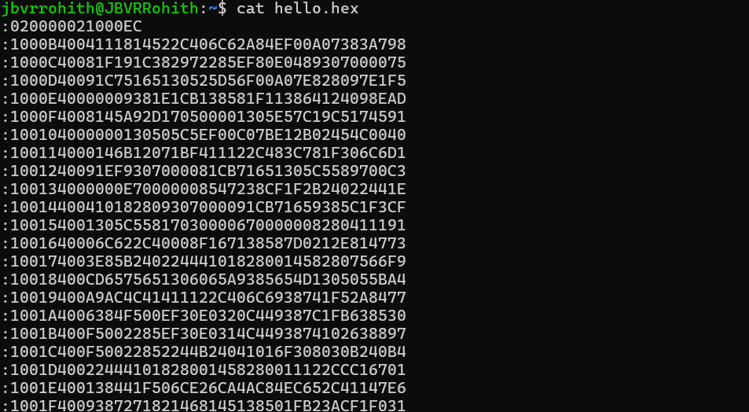

# Hex Dump and Disassembly
- Disassemble an ELF file to understand the instructions.
- Convert ELF to raw hex format.
- Understand each field in disassembly.

## ✅ Step 1: Disassemble ELF to Human-Readable Assembly

```bash
riscv32-unknown-elf-objdump -d hello.elf > hello.dump
```
- **`-d`** ~ disassemble all code sections (usually .text)
- **`hello.dump`** ~ now contains readable assembly



## ✅ Step 2: Convert ELF to Raw Hex Format
```bash
riscv32-unknown-elf-objcopy -O ihex hello.elf hello.hex
```
- **`-O ihex`** → output format is Intel HEX
- Useful for:
  - Flashing microcontrollers
  - Viewing or transferring raw program data


